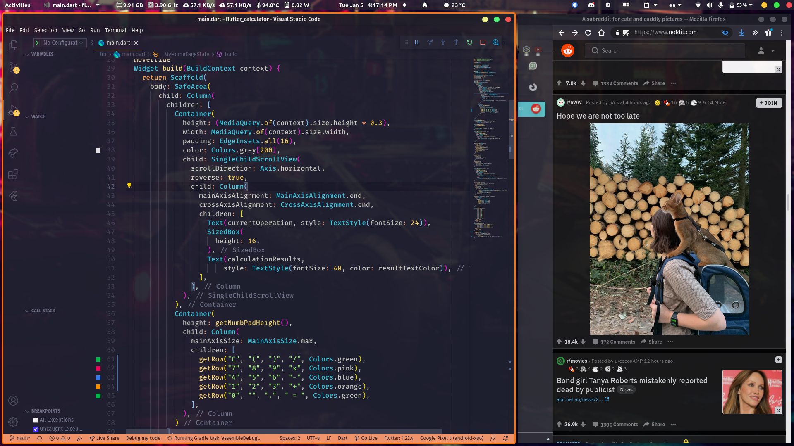

# Quick gnome transparency

this is a quick script to have some transparency on pop os 20.04 LTS using Gnome DE by using devilspie

## Notice

this works per application.

applications that are currently supported

- VScode
- Firefox
- Chromium
- Discord
- Nautilus (default gnome file manager)
- TeamViewer
- Gedit (default gnome text editor)

also gnome has no blur effect built in so it's better to a have a slightly blurred wallpaper

## Getting Started

1. install devilspie

```
sudo apt install devilspie
```

2. make .devilspie directory in home

```
cd ~
mkdir -p ~/.devilspie
```

3. clone this repo contents inside that folder or just copy&paste transparent.ds inside it

```
git clone https://github.com/elkhoudiry/gnome-transparency.git
```

4. when you type ls command it should look like this now

```
user@user-computer:~/.devilspie$ ls
README.md  result.png  transparent.ds
user@user-computer:~/.devilspie$
```

5. open a terminal and just run devilspie without root

```
devilspie
```

- you can make devilspie run on startup to eleminate setup #5

## Result


